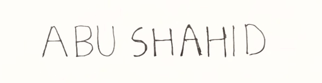

## Computer Vision
### Assignment-1
#### Abu Shahid
#### B20CS003

____
* The implementation can be found in the `.ipynb` file attached
* Execution of P3.py (question number 3) <br>
``` python3 P3.py <img_file.png>```
* To execute the file in google colab,
	* Comment line numbers: 11, 42, 43
	* Uncomment line numbers: 2, 12
____ 
###### <strong>Question 1- Spot the difference </strong>

a. Implementation can be found in the .ipynb file attached <br>
b. Algorithm
```py
let img1, img2
gray1 = gray( img1)
gray2 =  gray( img2)
diff = absolute_difference( gray1, gray2)
threshold -> the 'diff' is thresholded at pixel value= 25. 
#This makes all the similar regions black and the difference ican be seen as white silhouette in the thresholded image.
contour -> the active regions in 'threshold' are then used to draw contours
result -> contour image is then superimposed on the original image to get the difference
```
c.
<strong> Original Image </strong><br>

<br><strong style="text-align: center;" >Threshold of difference </strong><br>

<br><strong style='text-align : center;'>Result</strong><br>
<br>

d. <strong> Limitations </strong>
* The algorithm works by calculating pixel-pixel difference. So if the image is shifted, then then difference will be shown in the entire image.
* For the same reason, the algorithm is very sensitive to noise. Anything that is not an exact copy will be shown as difference.
* Minor differences may get lost while thresholding.

###### <strong>Question 2- Distance in images-1</strong>
a. Implementation can be found in the .ipynb file attached <br>
* The algorithm calculates mid-point of the bounding box given by the OCR. <br>
* These coordinates are then used to calculate the distance. <br>
* Each state is given a numerical code. <br>
	<br>
b. Limitations <br>
* The way algorithm calculates distance is by calculating the mid-points of the co-ordinates of the bounding box of state-names. Therefore, algorithm is sensitive to font of text and orientation chosen.


###### <strong>Question 3- Distance in images-2 </strong>
* Implementation can be found in `.ipynb` and `P3.py` file attached.
* Algorithm works by calculating the thickness of the perimeter and number of pixels in the perimeter. This is used to then give the radius and then the perimeter, area.
* Thickness of perimeter is calculated by counting number of black pixels along the diameter.


###### <strong>Question 4- Towards reading time </strong>
a. Implementation can be found in the .ipynb file attached <br>
b. Algorithm
```py
let clock_img
let clean_img = fine_line_purge( clock_img, thickness)
# fine_line_purge() erases all the lines whose thickness is less 
# than 'thickness' pixels. This is do so as to remove the 
# second's needle

let clk_gray = gray(clean_img)
binary -> clk_gray image is thresholded at pixel value 128
edge -> edge detection is applied on the binary image
let lines = HoughLines( edge, votes=45)
for all thetas in lines:
	thetas are clustered in two groups using Kmeans clustering
 angle -> tan inverse of difference of thetas
 ```
 <strong>Original clock image    </strong>   <br>
  <br>
 <strong> Image after fine_line_purge() </strong> <br> 
  <br>
  <strong>Plots from HoughLines</strong> <br>
  <br>
  <strong>Result</strong> <br>
  <br>
 
 c. Limitations
 * Algorithm will fail if the design of the clock has lines in it.
 * It also fails if the thickness of second's hand is comparable to other hands in the clock.
 * If the color of hands and the clock background is very similar, threshold can cause problems.
 
 
 
###### <strong>Question 5- Fun with Landmarks</strong>

NOTE: Implementation in `.ipynb` file uses grayscale images
Places chosen: <br>
* Aali-qapu <br>
 <br>
* Alberquerque temple <br>
 <br>
* Aksharadham <br>
 <br>
 
 a. Images were resized. <br>
 b. Average of the images <br>
  <br>
 c. Difference of image 1 and image 2 <br>
  <br>
 d. Adding salt and pepper to image 1 with 5% probability <br>
  <br>
 e. Various methods of denoising was implemented. Please check the attached `.ipynb` file <br>
 f. Convolving the mentioned kernel with image 3. <br>
  <br>

* Implementation of all the parts in `.ipynb` file

 
 
###### <strong>Question 6- Digit recognition</strong>
* Approach
```py
image0_files = list of 0 label images
image1_files = list of 1 label images
data = [] #corresponds to our dataset
for all image0_files, image1_files:
	hppf= horizontal_projection_profile_feature( img)
	data.append( [ hppf, img.label ])

train, val, test = data.split
clf1 = SVC( train, kernel= 'linear')
clf2 = SVC( train, kernel= 'poly', degree=3)
clf3 = KNN( train, neighbours= 5)
training, validation, testing accuracies are then reported

```

* HPPF is calculated as follows
```py
    height, width = img.shape

    horizontal_projection = np.zeros(height)
    for row in range(height):
        for col in range(width):
            if img[row, col] == 0:
                horizontal_projection[row] += 1
```

* SVM Model performance <br>
 <br>
Example predictions from Poly kernel model <br>
 <br>
 <br>

* KNN Model performance <br>
 <br>
Example predictions of KNN Model <br>
 <br>
 <br>


###### <strong>Question 7-W on B/ B on W</strong>
Approach
* Given the image it is converted to grayscale and, the bounding box coordinates of text is extracted using EasyOCR
* Average pixel value of the pixels inside and outside the box are calculated from the grayscale image
* If the inside value is lesser than outside, it is dark text of light background, else the opposite

 <br>
 <br>


###### <strong>Question 8- Template Matching</strong>
<br>
Reference: [gfg](https://www.geeksforgeeks.org/template-matching-using-opencv-in-python/)

Implementation can be found in the `.ipynb` file<br>
Approach<br>
* Image is binarized and `cv2.matchTemplate` is used to perform the template matching. 
* `cv2.TM_CCOEFF_NORMED` flag is used for matching which stands for Normalized Cross-Correlation Coefficient.
* A threshold is chosen to pick locations which can be considered a match.
* cv2.matchTemplate gives an array which represents the match between the template and the binary image at each location

Results<br>
* Template <br>

* Name <br>

* Results <br>


###### <strong>Question 9- Histogram Equalization</strong>

* Images at hand <br>


* Histogram of pixel values with bin size=10, using `cv2.calcHist()` <br>

* Results after histogram equalization using `cv2.equalizeHist()` <br>


* Histogram of equalized images <br>


###### <strong>Question 10- Reading Mobile Number</strong>
Approach:
* Use EasyOCR to read the text in the image
* Extract last three numbers


____
##### References
1. https://www.geeksforgeeks.org/template-matching-using-opencv-in-python/
